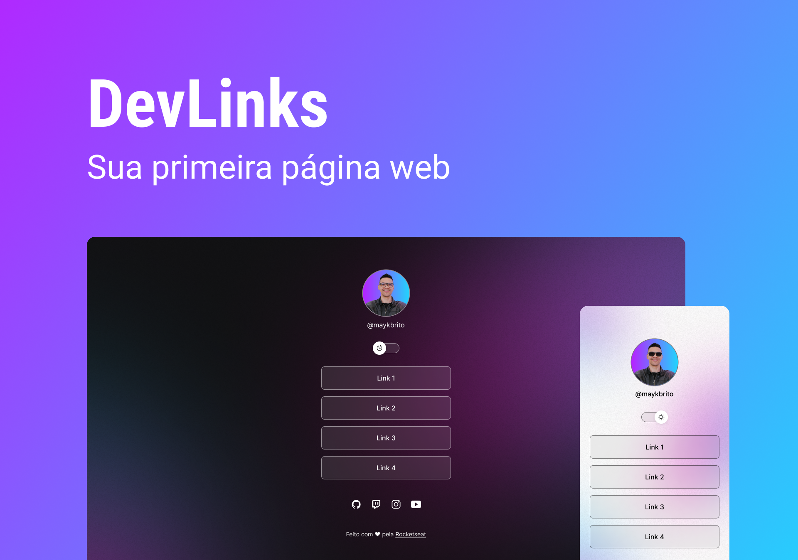

  DevLinks - Versão em React

  

## 💻 Projeto

O DevLinks é um agregador de links para usar como cartão de visitas online.

## ✨ Tecnologia

- [HTML](https://developer.mozilla.org/pt-BR/docs/Web/HTML)
- [CSS](https://developer.mozilla.org/pt-BR/docs/Web/CSS)
- [Javascript](https://www.javascript.com/)

## 🔖 Layout

Você pode visualizar o layout do projeto através do link abaixo:

- [Layout](https://www.figma.com/community/file/1187422022288947321)

Lembrando que você precisa ter uma conta no [Figma](http://figma.com/).

## 📝 License

Esse projeto está sob a licença MIT. Veja o arquivo [LICENSE](LICENSE) para mais detalhes.

---

  Feito com 💜 by Rocketseat

  <a href="https://discord.gg/rocketseat">👉 Participe da nossa comunidade 👈</a>

